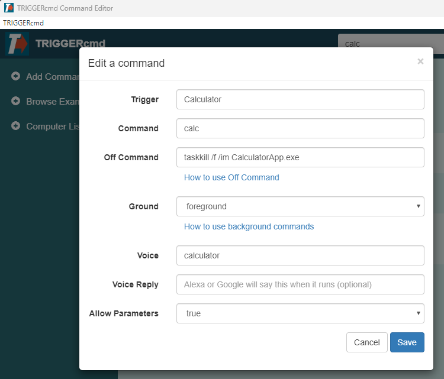

## Creating commands

The easiest way to add or edit commands is with the GUI Command Editor shown below.

| Field | Description |
| --- | ----------- |
| Trigger | The name of your trigger |
| Command | The command that will run when triggered |
| Off Command | The command that will run when triggered with "off" as the parameter |
| Ground | foreground or background agent |
| Voice | What you'll say to Alexa or Google Assistant |
| Voice Reply | What Alexa or Google Assistant will say back to you |
| Allow Parameters | Whether to allow parameters |

## Details

The **Trigger** field is basically a name for your command, but Alexa and Google Assistant don't use that name.  They use the **Voice** field to find your trigger.  

The **Off Command** field is only available when **Allow Parameters** is true because it will only run if the parameter is "off".  

Only set **Ground** to background if you've installed the background agent.  You can install the background agent on Windows and Linux (including Raspberry Pi), but not Mac.  The background agent starts when your computer boots instead of starting when you login, so you could use it to reboot even if you're not logged in.  

The **Voice Reply** field is only for the "conversational" Alexa skills:
* [TRIGGERcmd](https://www.amazon.com/gp/product/B06XFN2TZN)
* [TRIGGER command](https://www.amazon.com/gp/product/B074TV61DK) 
* [TC](https://www.amazon.com/gp/product/B0BMGG4SHS).  

The "[TRIGGERcmd Smart Home](https://www.amazon.com/gp/product/B07P1MMFRP)" skill/action does **not** use the **Voice Reply** field.  

The **Voice Reply** field can include the {{trigger}}, {{computer}}, and [{{result}}](https://www.triggercmd.com/forum/topic/422/have-alexa-or-google-assistant-say-the-result-of-a-command) placeholders.  

For added security, your commands are **not** stored in the cloud.  They are only stored on your computer in a file called commands.json.  You can find it in your .TRIGGERcmdData folder in your user's home folder.  You might want to back it up in case your hard drive dies.  