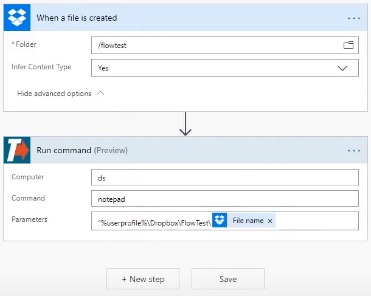

# Microsoft Power Automate

## Build a Microsoft Power Automate flow

1. When you create a flow, click New step, and select the **[TRIGGERcmd connector](https://powerautomate.microsoft.com/en-US/connectors/details/shared_triggercmd/triggercmd/)**

2. Fill pick a **Computer** and a command, **Command** to run.

3. Optionally, pass parameters from the previous step in the flow as a command parameter.

## Detailed walkthrough

