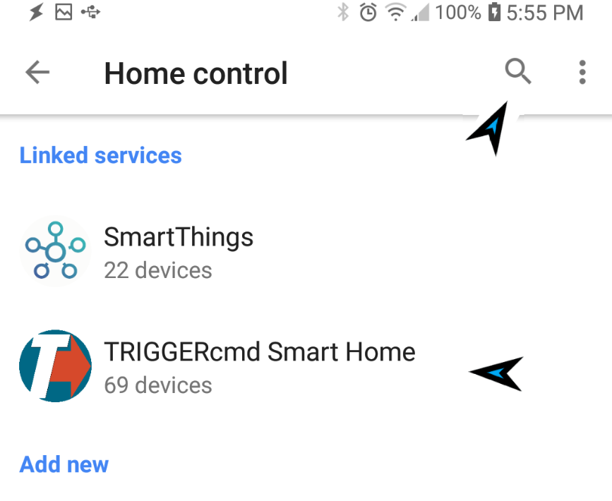

# TRIGGERcmd Smart Home Google Assistant action

## Activate the **TRIGGERcmd Smart Home** Google Assistant action

You find it in the Home app under Settings, Works with Google.  Just search for TRIGGERcmd.

After activation, you'll have a [virtual switch](./SmartHomeSwitches.md) for each of your commands that have a voice field filled in.  Your computer also needs the voice field filled in unless it's your default computer.  Your first computer is automatically your default computer.

This [YouTube video](https://youtu.be/jeiV5aySmTw) shows how it works.

To see a list of sentences that will run your commands via the TRIGGERcmd Smart Home action, see the [Smart Home Voice Commands](https://www.triggercmd.com/user/command/shprintlist?ai=Hey%20Google) page.

Use Google's script editor (not the Home app) to [create automations](https://www.triggercmd.com/forum/topic/2828/run-a-google-routine/4) that use TRIGGERcmd virtual switches.  The switches can be used as an **action** to run your command, or as a **starter** to run the routine when your command runs.

# Troubleshooting

If your [virtual switches](./SmartHomeSwitches.md) are offline, rename them to bring them back online.
