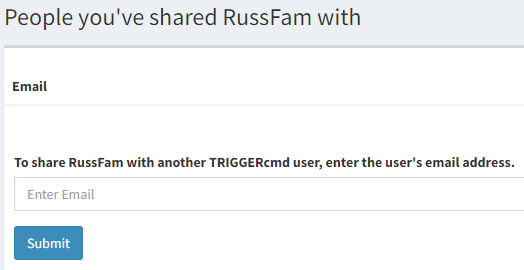

# Computerfreigabe

Sie können den Zugriff auf Ihre Computer mit anderen TRIGGERcmd-Benutzern teilen, damit diese bestimmte Befehle aus der Ferne ausführen können.

Weitere Informationen finden Sie in der offiziellen Dokumentation oder im Hilfeforum.

Wenn Sie einen Ihrer TRIGGERcmd-Computer mit einem anderen TRIGGERcmd-Benutzer teilen, kann dieser Benutzer Befehle auf diesem Computer ausführen.

Um einen Computer zu teilen, klicken Sie auf die Schaltfläche "Teilen".

Geben Sie dann die E-Mail-Adresse des anderen Benutzers ein.

Der Benutzer erhält eine E-Mail und muss den geteilten Computer akzeptieren.

Wenn jemand einen Computer mit Ihnen teilt, sehen Sie den geteilten Computer auf der Seite [Computer anderer Benutzer](https://www.triggercmd.com/user/computer/otherlist).

Um einen mit Ihnen geteilten Computer zu entfernen, löschen Sie ihn auf der Seite [Computer anderer Benutzer](https://www.triggercmd.com/user/computer/otherlist).

Um die Freigabe eines Ihrer Computer zu beenden, klicken Sie erneut auf die Schaltfläche "Teilen" und entfernen Sie den anderen Benutzer aus der Liste der Personen, mit denen Sie den Computer geteilt haben.
