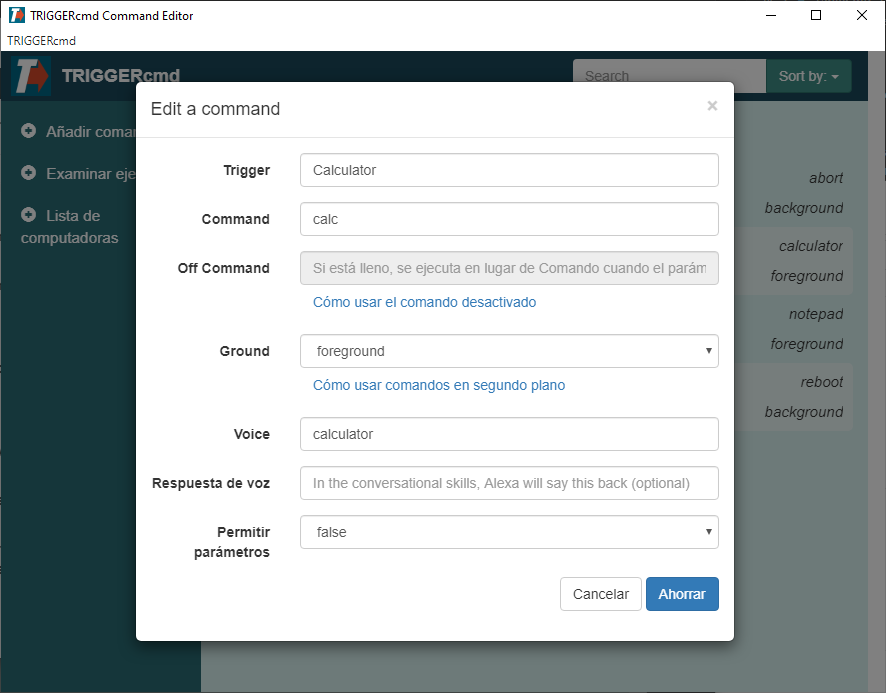

## Creando Comandos

La forma más sencilla de agregar o editar comandos es con el Editor de comandos GUI que se muestra a continuación.

| Campo | Descripción |
| --- | ----------- |
| Trigger | El nombre de tu Trigger |
| Command | El comando que se ejecutará cuando se active |
| Off Command | El comando que se ejecutará cuando se active con "off" como parámetro |
| Ground | agente de primer plano o de fondo |
| Voice | Lo que le dirás a Alexa o al Asistente de Google |
| Respuesta de voz | Lo que Alexa o el Asistente de Google te responderán |
| Permitir parámetros | Ya sea para permitir parámetros |

## Detalles

El campo **Trigger** es básicamente un nombre para su comando, pero Alexa y el Asistente de Google no usan ese nombre. Usan el campo **Voice** para encontrar el factor desencadenante.

El campo **Off Command** solo está disponible cuando **Allow Parameters** es verdadero porque solo se ejecutará si el parámetro está "off".

Solo configura **Ground** en segundo plano si has instalado el agente en segundo plano. Puede instalar el agente en segundo plano en Windows y Linux (incluida Raspberry Pi), pero no en Mac. El agente en segundo plano se inicia cuando su computadora arranca en lugar de iniciarse cuando inicia sesión, por lo que puede usarlo para reiniciar incluso si no ha iniciado sesión.

El campo **Voice Reply** es solo para las skills "conversacionales" de Alexa:
* [TRIGGERcmd](https://www.amazon.com/gp/product/B06XFN2TZN)
* [TRIGGER command](https://www.amazon.com/gp/product/B074TV61DK) 
* [TC](https://www.amazon.com/gp/product/B0BMGG4SHS).  

The "[TRIGGERcmd Smart Home](https://www.amazon.com/gp/product/B07P1MMFRP)" skill/action does **not** use the **Voice Reply** field.  

La skill/acción de hogar inteligente triggercmd **no** utiliza el campo **Respuesta de voz**.

El campo **Respuesta de voz** puede incluir los marcadores de posición {{trigger}}, {{computer}} y {{result}}. El marcador de posición {{result}} es donde Alexa podría decir el resultado de tu comando a través de una de las skills "conversacionales" de Alexa.

Para mayor seguridad, sus comandos **no** se almacenan en la nube. Solo se almacenan en su computadora en un archivo llamado commands.json. Puede encontrarlo en su carpeta .TRIGGERcmdData en la carpeta de inicio de su usuario. Es posible que desee hacer una copia de seguridad en caso de que su disco duro falle.