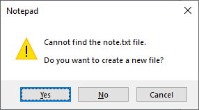

# Conversational Google Assistant actions

## DEPRECATED

Unfortunately you can no longer use the TRIGGERcmd or Trigger Command Google Assistant actions because Google [deprecated](https://developers.google.com/assistant/ca-sunset#:~:text=Google%20is%20sunsetting%20Conversational%20Actions,occurring%20on%20June%2013%2C%202023) all conversational actions.  

## Obsolete documentation

The original conversational Google Assistant action is was called "TRIGGERcmd."  The newer conversational action called "TRIGGER command" was created as an alternative.  They work the same except for the activation words.  

These are the basic sentence patterns to run a command via the three conversational actions:

* Hey Google, ask trigger C M D to run calculator.
* Hey Google, ask trigger command to run calculator.

To run a command on your default computer with parameters, say:

* Hey Google, ask trigger C M D to run notepad with parameter note.

This would run **notepad note** assuming your default computer runs Windows, it still has the built-in notepad command, and you've updated it to enable parameters.  Notepad will open and ask you if you want to create a new file called note.txt.

To run a command on your non-default computer with **laptop** in the computer's voice field, say:

* Hey Google, ask trigger C M D to calculator on laptop.

To see a list sentences to run your commands via the conversational actions, see the [Voice Commands](https://www.triggercmd.com/user/command/printlist?ai=Hey%20Google) page.

## Activate one of the original conversational Google Assistant actions

You can use these Amazon pages to link the conversational actions: 
* [TRIGGERcmd](https://assistant.google.com/services/a/id/5aba4539c049e69e)
* [TRIGGER command](https://assistant.google.com/services/a/uid/000000c97192e061) 

## Alternative Google Assistant actions

Most people should use the [TRIGGERcmd Smart Home](./SmartHomeHey Google.md) Google Assistant action instead of a conversational skill because Hey Google more consistently matches your spoken words to your commands when you use the TRIGGERcmd Smart Home skill.  