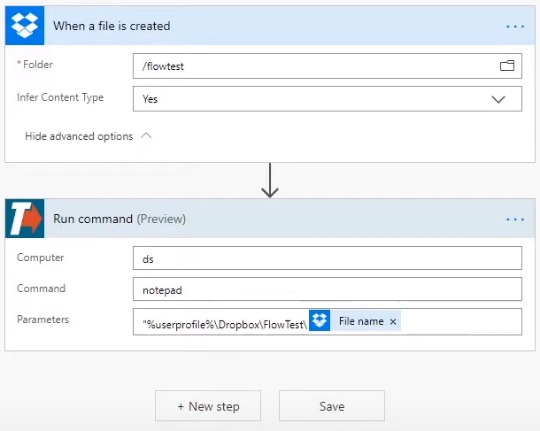

# Microsoft Power Automate

## Cree un flujo de Microsoft Power Automate

* Cuando cree un flujo, haga clic en Nuevo paso y seleccione **[CONECTOR TRIGGERcmd](https://powerautomate.microsoft.com/en-US/connectors/details/shared_triggercmd/triggercmd/)**

* Complete estos campos bajo Run command:
  * Command - Trigger name
  * Computer - Computer name
  * Parameters - Optionally include text from the previous flow step in command parameters

## Tutorial detallado

