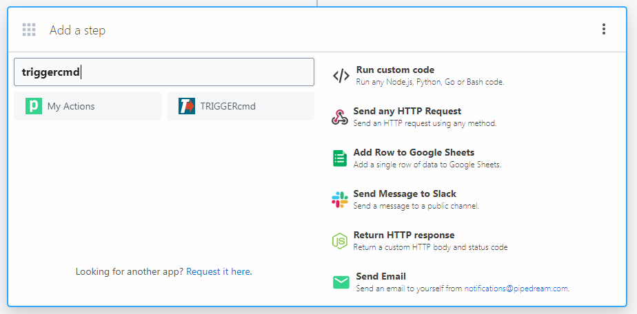
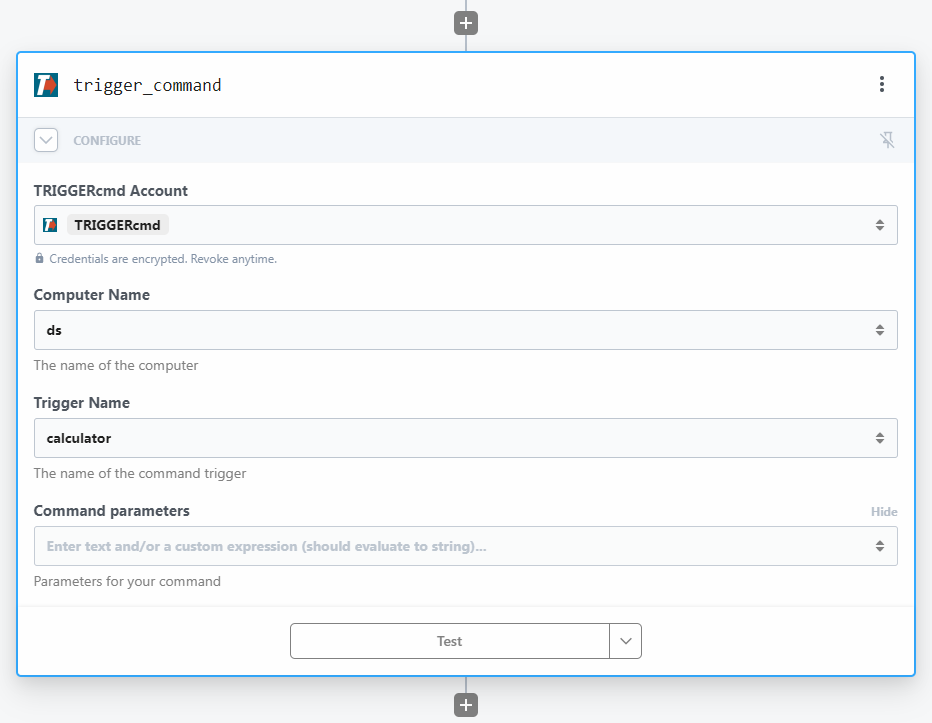

# Pipedream

Pipedream te permite crear "Workflows" utilizando varios servicios de Internet para automatizar cosas.

Puede crear un workflow que ejecute un comando en una de sus computadoras.

Haga clic [aquí](https://pipedream.com/apps/triggercmd) para conectar su cuenta de Pipedream a TRIGGERcmd, o busque TRIGGERcmd cuando agregue un paso de workflow.

Fill these field in your **trigger_command** step:
* Command - Trigger name
* Computer - Computer name
* Parameters - Optionally include text from the previous workflow step in command parameters

