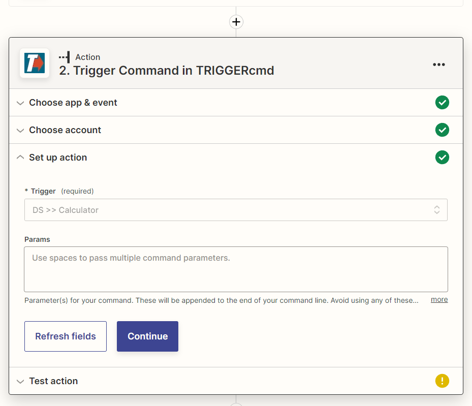

# Zapier

Zapier te permite conectar varios servicios de Internet para automatizar cosas usando lo que ellos llaman "Zaps".

Puede crear un Zapier Zap que ejecute un comando en una de sus computadoras.

Haga clic [aquí](https://zapier.com/apps/triggercmd) para conectar su cuenta de Zapier a TRIGGERcmd, o busque TRIGGERcmd cuando cree su Zap.

