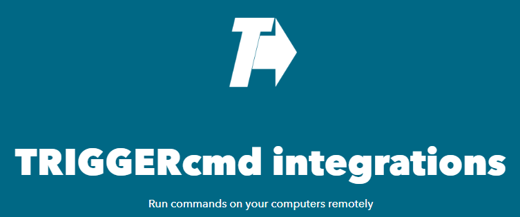

# IFTTT

Vous pouvez connecter TRIGGERcmd à IFTTT pour automatiser l'exécution de commandes sur vos ordinateurs. Créez des applets IFTTT qui déclenchent vos commandes via TRIGGERcmd.

Pour plus d'informations, consultez la documentation officielle ou le forum d'aide.

Pour utiliser l'intégration TRIGGERcmd avec IFTTT, cliquez [ici](https://ifttt.com/trigger_cmd) puis cliquez sur **Connect**.

Voici une [vidéo YouTube qui montre comment l'utiliser](https://youtu.be/NO6OASpij1c).

## Fonctionnement

IFTTT permet d'automatiser des tâches en connectant différents services. Avec TRIGGERcmd, vous pouvez déclencher des commandes sur vos ordinateurs à l'aide d'événements IFTTT.

Par exemple, vous pouvez configurer un applet pour exécuter une commande TRIGGERcmd lorsque vous recevez un e-mail ou lorsqu'un événement spécifique se produit sur un autre service.

## Configuration d'un Applet

1. Accédez à [TRIGGERcmd sur IFTTT](https://ifttt.com/trigger_cmd) et connectez votre compte.
2. Créez un nouvel applet et choisissez TRIGGERcmd comme action.
3. Saisissez le nom de la commande à déclencher et enregistrez l'applet.

## Conseils

* Assurez-vous que la commande à déclencher est déjà configurée sur votre ordinateur TRIGGERcmd.
* Vous pouvez utiliser des paramètres pour des commandes avancées.
* Consultez la [documentation officielle](https://www.triggercmd.com) pour plus d'exemples et d'assistance.
