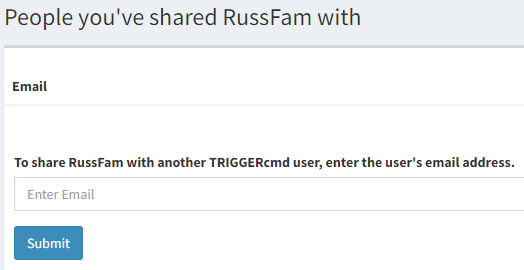

# Condivisione del computer

Se condividi uno dei tuoi computer TRIGGERcmd con un altro utente TRIGGERcmd, quell'utente potrà eseguire i tuoi comandi su quel computer.

Per condividere uno dei tuoi computer, fai clic sul pulsante Condividi.

Quindi inserisci l'indirizzo email dell'altro utente.

L'utente riceverà un'email e dovrà accettare il computer condiviso.

Se qualcuno condivide un computer con te, vedrai il computer condiviso nella pagina [Computer di altri utenti](https://www.triggercmd.com/user/computer/otherlist).

Per rimuovere un computer condiviso con te, eliminalo dalla pagina [Computer di altri utenti](https://www.triggercmd.com/user/computer/otherlist).

Per interrompere la condivisione di uno dei tuoi computer, fai di nuovo clic sul pulsante Condividi e clicca su elimina l'altro utente dall'elenco delle persone con cui lo hai condiviso.
