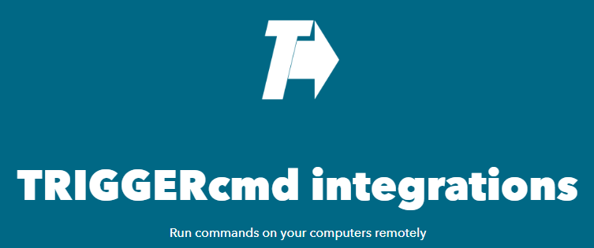

# IFTTT

Puoi collegare TRIGGERcmd a IFTTT per automatizzare l'esecuzione di comandi sui tuoi computer. Crea applet IFTTT che attivano i tuoi comandi tramite TRIGGERcmd.

Per maggiori informazioni, consulta la documentazione ufficiale o il forum di supporto.

Per utilizzare l'integrazione TRIGGERcmd con IFTTT, clicca [qui](https://ifttt.com/trigger_cmd) e poi su **Connect**.

Ecco un [video YouTube che mostra come utilizzarlo](https://youtu.be/NO6OASpij1c).

## Come funziona

IFTTT consente di automatizzare attività collegando diversi servizi. Con TRIGGERcmd puoi eseguire comandi sui tuoi computer utilizzando eventi IFTTT.

Ad esempio, puoi configurare un applet per eseguire un comando TRIGGERcmd quando ricevi un'email o quando si verifica un evento specifico in un altro servizio.

## Configurazione di un Applet

1. Vai su [TRIGGERcmd su IFTTT](https://ifttt.com/trigger_cmd) e collega il tuo account.
2. Crea un nuovo applet e scegli TRIGGERcmd come azione.
3. Inserisci il nome del comando che vuoi eseguire e salva l'applet.

## Suggerimenti

* Assicurati che il comando che vuoi eseguire sia già configurato sul tuo computer TRIGGERcmd.
* Puoi utilizzare parametri per comandi avanzati.
* Consulta la [documentazione ufficiale](https://www.triggercmd.com) per altri esempi e supporto.
