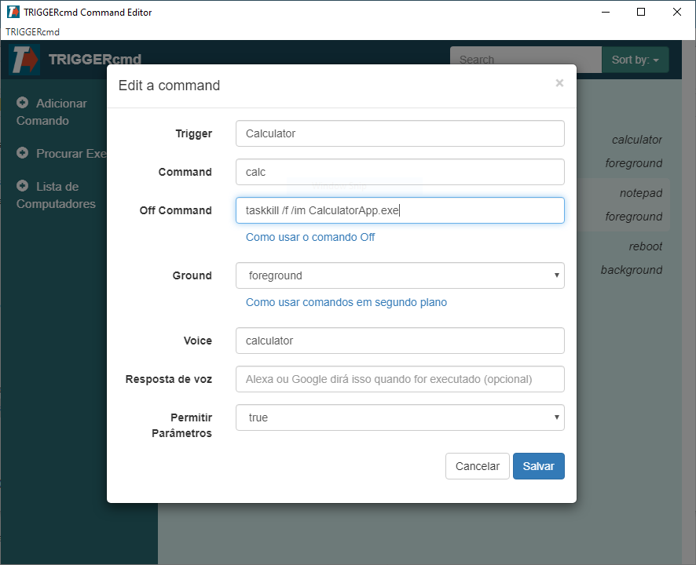

## Criando comandos

A maneira mais fácil de adicionar ou editar comandos é com o Editor de Comandos GUI mostrado abaixo.

| Campo | Descrição |
| --- | ----------- |
| Trigger | O nome do seu trigger |
| Command | O comando que será executado ao ser acionado |
| Off Command | O comando que será executado ao ser acionado com "desligar" como parâmetro |
| Ground | Agente em primeiro plano ou segundo plano |
| Voice | O que você dirá para a Alexa ou o Google Assistant |
| Resposta por voz | O que a Alexa ou o Google Assistant irão responder |
| Permitir Parâmetros | Se permite parâmetros |

## Detalhes

O campo **Trigger** é basicamente um nome para o seu comando, mas a Alexa e o Google Assistant não usam esse nome. Eles usam o campo **Voice** para encontrar o trigger.

O campo **Off Command** só está disponível quando **Permitir Parâmetros** está ativado, pois ele só será executado se o parâmetro for "desligar". 

Defina **Ground** como segundo plano apenas se você tiver instalado o agente em segundo plano. Você pode instalar o agente em segundo plano no Windows e Linux (incluindo o Raspberry Pi), mas não no Mac. O agente em segundo plano é iniciado quando o seu computador é ligado, em vez de iniciar quando você faz login, então você pode usá-lo para reiniciar mesmo que não esteja logado.

O campo **Resposta por voz** é apenas para as habilidades "conversacionais" da Alexa:
* [TRIGGERcmd](https://www.amazon.com/gp/product/B06XFN2TZN)
* [Comando TRIGGER](https://www.amazon.com/gp/product/B074TV61DK) 
* [TC](https://www.amazon.com/gp/product/B0BMGG4SHS).  

A habilidade "[TRIGGERcmd Smart Home](https://www.amazon.com/gp/product/B07P1MMFRP)" **não** utiliza o campo **Resposta por voz.**

O campo **Resposta por voz** pode incluir os marcadores {{trigger}}, {{computer}} e [{{result}}.](https://www.triggercmd.com/forum/topic/422/have-alexa-or-google-assistant-say-the-result-of-a-command) O marcador {{result}} é onde a Alexa pode dizer o resultado do seu comando através de uma das habilidades "conversacionais" da Alexa.

Para maior segurança, os seus comandos **não** são armazenados na nuvem. Eles são armazenados apenas no seu computador em um arquivo chamado commands.json. Você pode encontrá-lo na sua pasta .TRIGGERcmdData na pasta do seu usuário. Talvez você queira fazer backup dele caso o seu disco rígido falhe.  