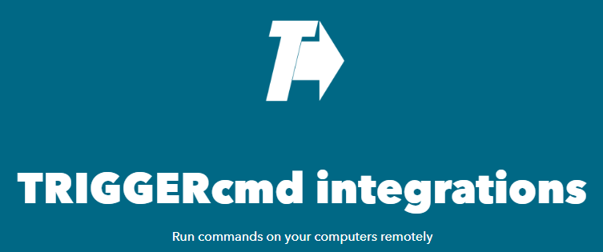

# IFTTT

Para usar a integração TRIGGERcmd com o IFTTT, clique [aqui](https://ifttt.com/trigger_cmd) e depois clique em **Connect**.

Aqui está um [vídeo do YouTube que mostra como utilizá-lo](https://youtu.be/NO6OASpij1c).

