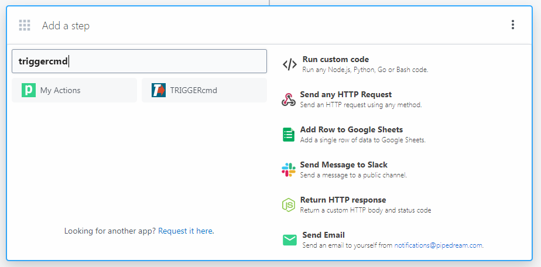

# Pipedream

O Pipedream permite que você crie "Fluxos de Trabalho" usando vários serviços da Internet para automatizar tarefas.

Você pode criar um fluxo de trabalho que executa um comando em um dos seus computadores.

Clique [aqui](https://pipedream.com/apps/triggercmd) para conectar sua conta do Pipedream ao TRIGGERcmd, ou procure pelo TRIGGERcmd ao adicionar uma etapa ao fluxo de trabalho.

Preencha esses campos na sua etapa **trigger_command**:
* Comando - Nome do trigger
* Computador - Nome do computador
* Parâmetros - Opcionalmente inclua texto da etapa anterior do fluxo de trabalho nos parâmetros do comando

