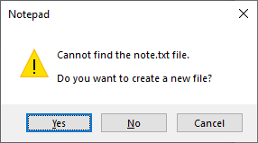

# Conversational Alexa skills

The original conversational Alexa skill is was called "TRIGGERcmd."  The newer conversational skills called "TRIGGER command" and "TC" were created as alternatives.  They work the same except for the activation words.  

These are the basic sentence patterns to run a command via the three conversational skills:

* Alexa, ask trigger C M D to run calculator.
* Alexa, ask trigger command to run calculator.
* Alexa, ask T C to run calculator.

To run a command on your default computer with parameters, say:

* Alexa, ask trigger C M D to run notepad with parameter note.

This would run **notepad note** assuming your default computer runs Windows, it still has the built-in notepad command, and you've updated it to enable parameters.  Notepad will open and ask you if you want to create a new file called note.txt.

To run a command on your non-default computer with **laptop** in the computer's voice field, say:

* Alexa, ask trigger C M D to calculator on laptop.

To see a list sentences to run your commands via the conversational skills, see the [Voice Commands](https://www.triggercmd.com/user/command/printlist) page.

## Activate one of the original conversational Alexa skills

You can use these Amazon pages to link the conversational skills: 
* [TRIGGERcmd](https://www.amazon.com/gp/product/B06XFN2TZN)
* [TRIGGER command](https://www.amazon.com/gp/product/B074TV61DK) 
* [TC](https://www.amazon.com/gp/product/B0BMGG4SHS)

## Alternative Alexa skills

Most people should use the [TRIGGERcmd Smart Home](./SmartHomeAlexa.md) Alexa skill instead of a conversational skill because Alexa more consistently matches your spoken words to your commands when you use the TRIGGERcmd Smart Home skill.  