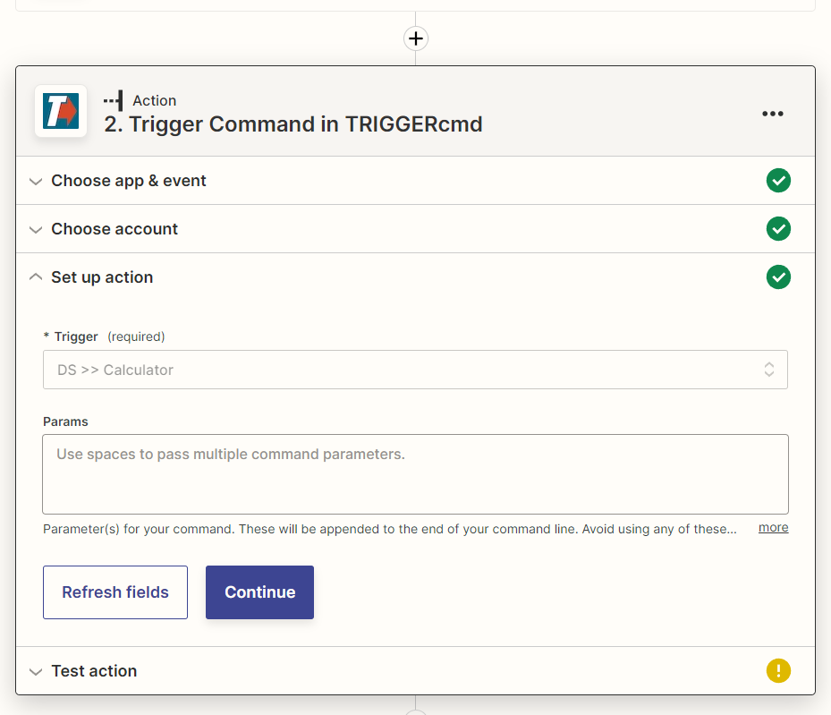

# Zapier

Zapier let's you connect various Internet services together to automate things using what they call "Zaps."

You can create a Zapier Zap that runs a command on one of your computers.

Click [here](https://zapier.com/apps/triggercmd) to connect your Zapier account to TRIGGERcmd, or lookup TRIGGERcmd when you build your Zap.

